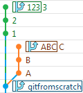

# Sticky-notes and paintbrushes

What's a branch, you ask?  Well, you might think this is a branch:

...but a branch is actually *much* simpler than that.  **A branch is a name that points to a commit**.  Commits have weird names - `518a9d2blahblahblah`.  Branches let us use an easy-to-read name to mark a commit.

We use branches in two ways:
1. As sticky-notes to mark a certain spot in history.
2. As paintbrushes for making new commmits.

Branches have two cousins: remote branches and tags.  They all work the same way - a name that points to a commit - but they have different rules for how they can move.  In the history table, they look like this:

| Kind of ref                      | What does it do?            |
|--                                |--                           |
|  Branch | Marks a moveable spot in history and makes new commits. There are lots of ways to use a branch, and we'll show you all of them. |
|  Remote branch | Keeps track of where a friend's branch is. You can't move it directly - it gets moved automatically when you download or upload from your friend's repository. |
|  Tag (a.k.a. permanent branch) | Marks a permanent spot in history.   |

Branches are easy to manipulate.  Right-click a commit to create a new branch.  You can drag-and-drop to move it around.  Right-click the branch again to delete it.

## Using a branch as a paintbrush

Remember that a commit is a snapshot of every single file in your project folder.  Surprisingly, when you click a commit, you won't see all the files in the snapshot - you'll see changes.  X was added, Y was deleted, Z was changed.  That's because **every commit knows who its parent is, so that you know what to compare it to.**  When you click a commit, it shows you what files have changed relative to its parent.

**When you make a new commit, you can choose any commit in the whole repository to be the starting point.**  You can even make a commit with no parents, or two parents, or ten parents, but we'll get to that later.  99% of the commits you make will have just one parent.

**The HEAD branch determines the starting point for the next commit.**  When the next commit is made, the HEAD branch will automatically move so that it points to the new commit.  Here's an example of what that looks like in practice:

Here's what happened in the video above:
1. We start off with six new files in our working copy, named 1, 2, 3, A, B, C.
2. We create a new branch, and name it 123.
3. We checkout 123 (this makes 123 the new HEAD).
4. We commit 1, then 2, then 3.
5. We create another new branch, name it ABC, and check it out (now ABC is the new HEAD)
6. 123 disappears, so we add it as a tip.
7. We commit A, then B, then C.

You'll find all kinds of advice on how you should name your branches.  Remember this: **just as a painting is made of paint rather than brushes, so too is a repository made of commits rather than branches.**  Naming conventions are important when you're sharing work with a team, but for branches that are just for yourself, don't spend any more time on their names than you would on any other sticky-note - they're not a part of your project's permanent history.

## Using a branch as a sticky note

In the previous example, something surprising happened when we checked out ABC.  123 disappeared!  But when we added it back as a "tip", it just magically came back!  What's going on?

As far as the files in your working copy are concerned, the only commits that matter are the ancestors of the HEAD commit - none of the other commits have any effect.  As you'll see when you learn more about moving commits around, it's really common to make a bunch of messy commits and later throw them away.  You don't want a bunch of discarded commits cluttering up your history table, so DiffPlug only shows you the ancestor commits.  **If you want to see commits which aren't ancestors of HEAD, you have to explicitly add a branch to tips which does have those commits as ancestors.**

The tips section is useful for searching for branches and navigating history.  When you hover the mouse over a branch, it will scroll the history window to show you where that branch is.  When you stop hovering, it will scroll back to where you were.

If you click a branch, it will scroll the history window there and stop.

