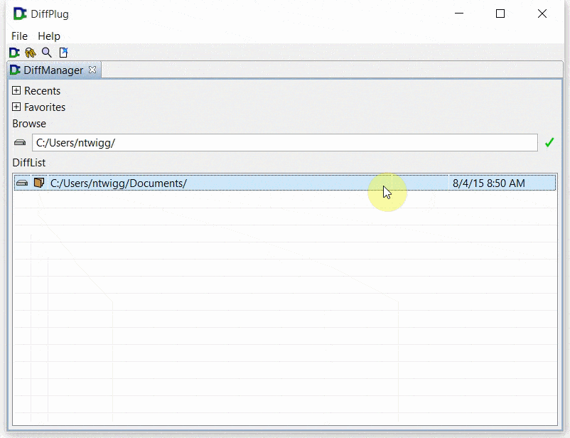

### Clone an existing repository

If you'd like to try cloning any arbitrary project, the [source code to this website](https://github.com/diffplug/gitfromscratch) is a nice simple example.

Git tracks all of the files which are contained by a folder (including sub-directories, sub-sub-directories, etc).  To start working on an existing repository, you'll need to grab a copy of that folder and all of its history.  This is called *cloning*.

There are two things you're going to need:
1. The URL you want to clone from
    + This acts like the "phone number" which git will call to ask for the latest version.
    + Later on, we'll show you [how to upload changes you make to this URL](Upload).
2. The folder on your computer where you're going to put the clone

Go to wherever you'd like to put your clone, and *right-click -> Git -> Clone*.  This will open a dialog where you can put the URL, and DiffPlug is happy to make a new destination folder for you if you want.  Once the download completes, you'll have your shiny new clone.

