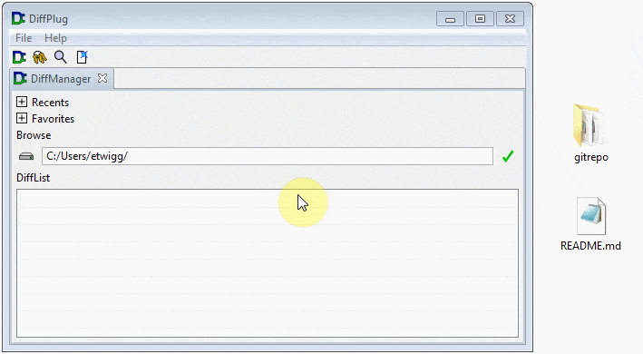
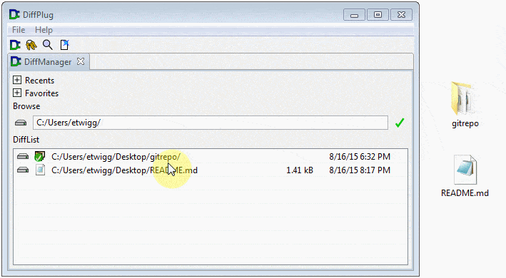
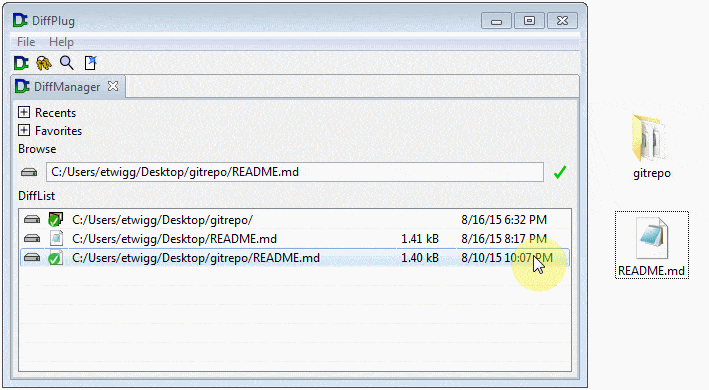

# Basic navigation

This tutorial is about git.  But if you want to use git on files that aren't code, or even if you work with code but you just don't want to learn all the command-line flags, then we recommend DiffPlug.  DiffPlug is a piece of software that's similar to your operating system's file browser, except that it's built from the ground-up for looking at the *history* of files and comparing them.  Before you can work with git, there are just a couple things you need to know about basic navigation in DiffPlug first.

The  icon brings up the *DiffManager*.  This is a scratchpad where you can put files that you're interested in for comparing them later.  To put a file on the DiffList, drag it there from your desktop.  You can also drag files to the "D" icon and they'll be added to the DiffList.

Alternatively, you can find a file using fuzzy search in the browse bar.

Anywhere that you see a file in DiffPlug, you can right-click it to get a context menu of history and comparison-related actions.  In the browse bar, you can get this context menu by pressing `Enter`, or by clicking the check mark.

