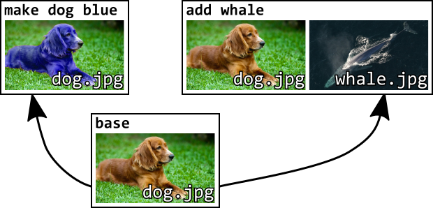
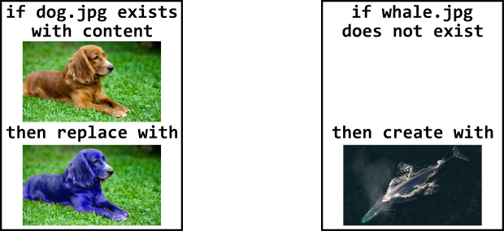
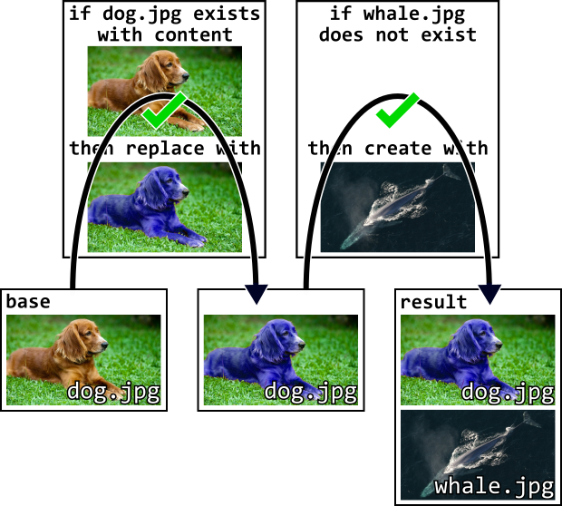
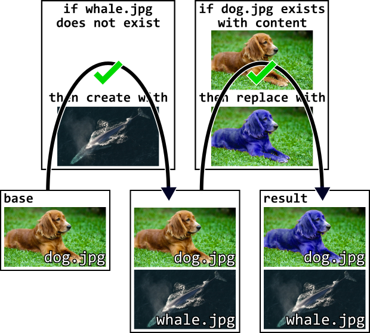
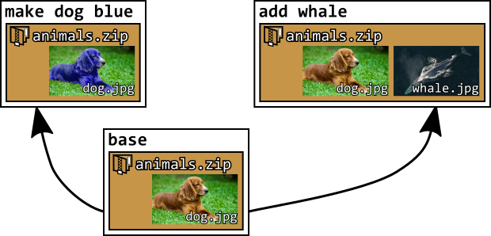
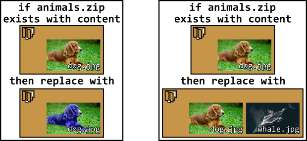
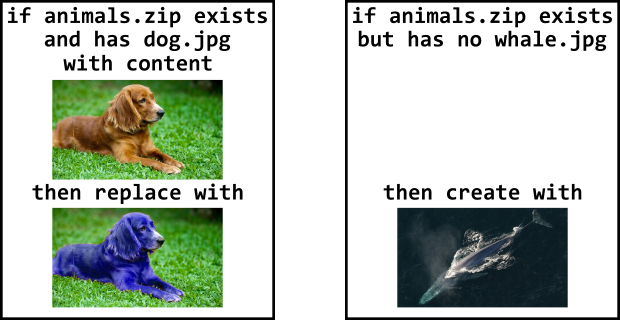

# Patches are the "flux capacitor" of work

When you try to merge two branches, one of two things will happen:

1. Your tools will magically smush the changes back together.
2. Your tools will yell at you.

The magic that makes this work is a "patch", and now is the time to take away the magic.

## The goal: redo your work for you

The reason merge conflicts occur is that while you were working off of version 1, the team moved along and published version 2.  So now you have to take all the work you did on version 1, and redo it on top of version 2.

The objective of a patch is to **redo your work for you, automatically**.  This involves two steps:

1. Infer the work that you did, and turn that into a recipe
2. Apply that recipe to the new version

## Following a recipe

Our final goal is to have a recipe we can apply to a newer version of the project, so let's start there.  Somehow, we figure out that all of your work simplifies down to `Add 'whale.jpg'`.  Let's apply that recipe to a few different projects.

| Before                                        | After `Add 'whale.jpg'`             |
|--                                             | --                                  |
|          |  |
|                |        |
|  | Unclear                             |

<!---
docs:
- docs.txt
- demo.zip

c:
- MAKEFILE
- main.c
- zlib.c

conflict:
- squirrel.jpg
- whale.jpg
-->

The first two examples have wildly different content, but we can still easily apply the same recipe to each.  For the last example, the recipe seems to conflict with what's already there.  Maybe we should overwrite the old file?  Let's table that issue for now...

## Inferring a recipe

Applying the recipe is usually easy, but where does it come from?  Well, let's take a look at each of the before and afters above, and use that to create a diff.

| Before                                        | After                                       | Diff                                       |
|--                                             | --                                          | --                                         |
|          |          |           |
|                |                |                 |

It turns out that a diff *is* a recipe - there's a 1:1 correspondence between the diff and the recipe we followed above.

## Recipe preconditions

In the example above, it was easy to apply the recipe so long as there wasn't already a file named `whale.jpg`.  If that file already existed, then we had to decide if we should overwrite what was already there.  The safest option is to not overwrite anything, and instead alert the user that the recipe conflicts with the existing content.  Then the user can look at the existing content and the recipe side-by-side, then decide for herself.

Let's look at another example:

- v1: we add `readme.txt`, whose content is `TODO`.
- v2: we delete `readme.txt`
- v3: we add `readme.txt`, whose content is `I hereby bequeath all my worldly posessions to my dog.`

If we create a patch from v1 to v2, we get `Delete 'readme.txt'`.  If we then apply this patch to v3, we'll delete a very important document!  In order to make this recipe safer, let's make it more specific: `If 'readme.txt' has content 'TODO' then delete it.`.

In order to make sure that a patch never destroys information inadvertently, a patch recipe always asserts what the project needs to be before the recipe can be applied.  Here's how that looks:

- addition: if `readme.txt` does not exist, create it with content `TODO`
- removal: if `readme.txt` exists with content `TODO`, delete it
- change: if `readme.txt` exists with content `TODO`, repace it with content `I hereby bequeath all my worldly posessions to my dog.`

Earlier, we realized that any diff is a recipe that we can follow.  **The defining characterestic that upgrades something from an ordinary diff to a patch is a precondition on the existing content which allows a rigorous guarantee that applying the patch will not cause information to be accidentally overwritten.**

## Combining multiple patches

Let's try to merge these two branches.

Using the preconditions we just learned about, we can generate these patches for each side:

Because the patches don't touch the same files, their order doesn't matter.  Whether we start with the dog,

or we start with the whale,

we get the exact same final result.  This only works if the patches don't touch the same file, and it always works if the patches don't touch the same file.

## Patches that touch the same file

Let's say that instead, we have these branches:

Which gives us these patches:

There's no way to apply both patches, because once we have applied one, we have violated the preconditions for the other.  If we can put a man on the moon, we should be able to fix this.  Instead of treating `animals.zip` as an indivisible entity, we ought to be able to refer to its contents just like we refer to the contents of our project, right?

## Making patches that can share a file

In order for our patches to share the zip file, we need to:

- read the individual pieces of the zip file
- identify a specific piece, and a precondition on its content
- modify that piece to have new content
- put the zip file back together now that we have changed its content

Then our patches could look like this:

Vanilla git treats zip files as indivisible, so it's not able to do this.  But it is able to do this for text files.

## Text patches

Making patches to a tree of files is fairly easy because it's easy to identify a specific piece - that's what file names are for!  It's a little harder for text files.

Let's look at this scenario:

<!---
The Merry Versions of Vindsor
Act II, Scene 2

Git: I will not merge thy zip.
User: Why then the world's mine oyster,
	Which I with DiffPlug will open.
Git: Not a byte.
-->

One way we could try to identify pieces is with line numbers.  Let's try that:

Hmmm... relying on position alone is not very robust.  Let's instead try using the content of the line above and below what we're trying to change.

<!---
above: User: Why then the world's mine oyster,
below:      Which I with sword will open.
before:      Which I with sword will open.
after:      Which I with DiffPlug will open.
-->

Great!  In fact, this is exactly how conventional "diff/patch" works, although conventional diff/patch tries to use more than just one line of context.

## Patching other things

We've already outlined how zip files could be patched, but what about other kinds of file?  Stay tuned to DiffPlug for upcoming announcements!

So far, we've used patches to solve a problem we encountered while merging.  Unsurprisingly, the ability to automatically redo work is useful [for a lot more than just merging](../cherry-pick-and-rebase/cherry-pick-and-rebase.md).
